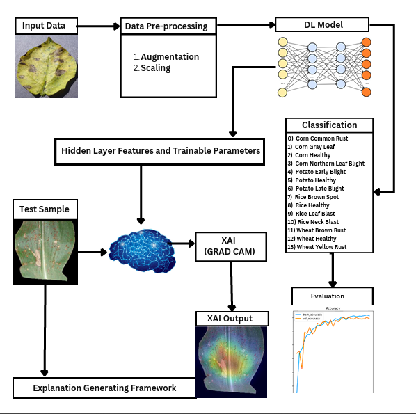
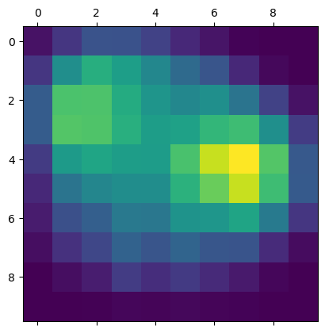

# Deep-Neural-Networks-for-Crop-Disease-Detection-and-Interpretability-XAI

<strong>Dataset Analysis: <strong>  

The dataset used in this thesis comprises a collection of
images representing different plant species and their associated
diseases. The dataset is divided into four main categories:
corn, potato, rice, and wheat. Each category consists of specific
disease classes and a healthy class for comparison. The total
number of classes in the dataset is 14, with a combined total
of 13,024 images. 

A. Plant Overview 
1) Corn Plant Species: The corn category contains images
depicting diseases such as Common Rust, Gray Leaf Spots, and
Northern Leaf Blight, along with a class representing healthy
corn plants. The dataset includes a total of 3,852 images, with
Common Rust has 1,192 images, Gray Leaf Spot having
513 images, Northern Leaf Blight has 985 images, and
the Healthy class has 1,162 images. These images were
obtained from the widely-used PlantVillage dataset. 

2) Potato Plant Species: The potato category comprises
images related to Early Blight, Late Blight, and healthy potato
plants. A total of 2,152 images are included in this category,
with 1,000 images each for Early Blight and Late Blight, and
152 images representing the Healthy class. The images in this
category were collected from the PlantVillage dataset. 

3) Rice Plant Species: The rice category includes images
representing diseases like Brown Spot, Leaf Blast, and Neck
Blast, along with a Healthy class. The dataset consists of 4,078
images, with 613 images for Brown Spot, 977 images for Leaf
Blast, 1,000 for Neck Blast, and 1,488 for the Healthy class.
The images in this category were sourced from the ”DhanShomadhan” dataset [4] and the ”Rice Leafs” dataset from
Kaggle. 

5) Wheat Plant Species: The wheat category contains 
images related to diseases such as Brown Rust, Yellow Rust,
and healthy wheat plants. It consists of 2,942 images, with
902 images for Brown Rust, 924 images for Yellow Rust, and
1,116 images representing the Healthy class. The origin of the
wheat images used in this dataset was Kaggle. 
B. Data Distribution 
I can calculate the distribution of images in each class
to understand the relative representation of different plant diseases and the healthy class.  
Total images: 2942 images

**My methodology:**  
  

This section presents the proposed methodology of the
proposed methodology for exploring deep neural networks
for crop disease detection and interpretability. Our model has
two parts. The first is dedicated to capturing visual attributes,
and the second is focused on providing information about
our model’s predicted effects and potential biases. We will
now provide a breakdown of each individual step within this
architectural framework, 

A. Input Image 
In our Dataset, there is no directory for the training, testing,
and validation. All the image classes stack into one folder. So
before sending the images to our model, we need to split the
dataset into three parts 

I) Data Splitting: Data is often separated into three sets:
training, testing, and validation. The training set is used
to train the model, the validation set is used to fine-tune
hyperparameters and model selection, and the test set is used
to evaluate the model’s performance on unknown data. So,
we split the dataset with 70% for training, 20% for testing,
and 10% for validation. 

II) Data into Batch: Crop disease images from the training
dataset are presented to the proposed model batch by batch.
For our work batch size is 32. 

B. Image Preprocessing 
Preprocessing is a data preparation step in machine learning
that aims to improve data quality and suitability for training
models. It involves techniques like removing unwanted
distortion, balancing class imbalances, and applying various
transformations to images. It involves various techniques to
clean, transform, and balance the data. So, we ensure that
all images are the same size and to enable more effective
processing, we pre-processed each image by scaling it to
299*299*3. The rescaling technique is used to reduce the
image pixels will be scaled between 0 and 1. Our model can
learn more interesting features why we also use different
types of augmentation techniques such as 

I) Color Jitter: Color jitter contains different types of image
color modification tools like brightness, contrast, saturation,
and hue. That means we send the data to our model with
variety . 

II) Random Flip: Images may be flipped horizontally
or vertically at random. This is done at random to show
the model diverse perspectives on items. It’s analogous
to showing the computer how things may seem from the
opposite side. This improves the computer’s learning since it
sees more ways that objects might appear. 

III) Random Height and Weight: Images may be set height
and weight at random. This is done at random to show
the model diverse perspectives on items. This improves the
computer’s learning since it teaches models to detect even if
height and weight are changed randomly of image. 

III) Random Rotation: Using random rotations causes
variety in the orientation of the pictures. This is especially
beneficial when images in the collection have varying
orientations. 

IV) Random zoom: Using random zoom causes variety in
The visualization of the pictures 

C. Feature Extraction 
In our projecThe we were tasked with interpreting and making
sense of the information hidden inside images. To address this,
we used a complex mechanism known as transfer learning, which allows us to apply the insights obtained from
training neural networks on large and varied picture datasets. 
We began by selecting three well-known pre-trained convolutional neural network (CNN) models: InceptionV3, VGG19,
and Exception. These models have been painstakingly trained
on enormous arrays of photos to detect nuanced patterns,
characteristics, and relationships. Because of their thorough
training, they have already learned to recognize distinct objects, forms, textures, and colors - key features critical for
image comprehension. 
Instead of building our models from scratch, we used the
power of these pre-trained models. We input our images into
these neural networks, which then analyzed the images layer
by layer, unraveling their contents. The models divided the
photos into smaller, relevant components and highlighted the
distinctive traits that distinguish each image. 
So, it can be said that we obtained a significant advantage
by incorporating these pre-trained models into our strategy.
We were able to concentrate on the finer aspects of our
images that were important to our research, such as specific
features that may assist us in distinguishing between distinct
classes and concepts. Finally, we ran all the models with same
hyperparameter setup like  
batch size = 32, iterations= 30000, learning rate = 1e-4
and epoch= 105, the epoch is calculated by this formula 
iterations/Len(train dataset)/batch size  
We also use the optimizer as Adam and the loss function
as ’categorical cross entropy for multiclass classification. We
also, use early stop criteria at the time of training to avoid
overfitting and we save the best model for further activity. 

D. Evaluate The Model: 
Accuracy, Precision (P), recall (R), and weighted F1-score
are used to compare performance. The model’s misclassification rate has been utilized as one of the metrics to effectively
compare its performance across several classes. To evaluate
how well the model performs, we utilize the weighted F1-
score measure. 

E. Apply XAI for Explanation: 

 

 

We went a step further in our research by using eXplainable
Artificial Intelligence (XAI) approaches to the models. When
we examined the images from our dataset, this allowed us to
understand how these models were operating. Grad CAM [24],
which means Gradient-weighted Class Activation Mapping,
was used as our first method. With the use of this method,
we may identify the regions of the image that the model is
focusing on more than others. 
But, while we were looking at the data, we saw something
interesting. For most of the images we tested, our model
seemed to zoom in on the right parts – the important areas of
the pictures. This matching between where the program was
looking and the correct parts of the pictures showed that our
program was doing a good job at understanding and finding
the important things. 
